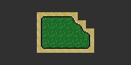
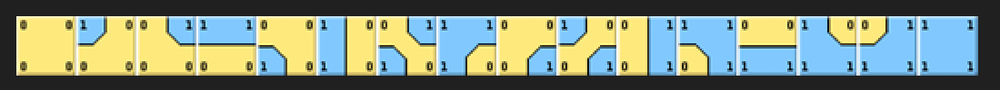
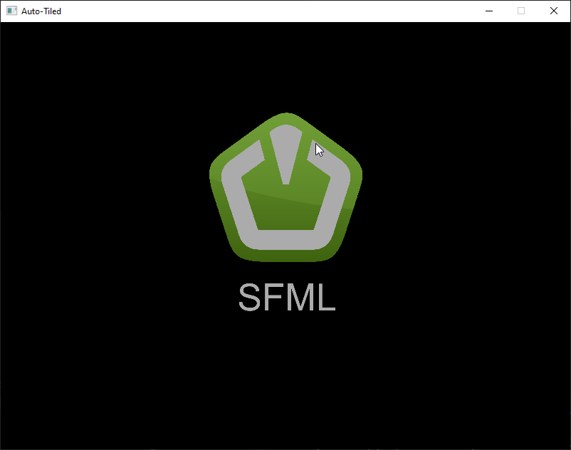
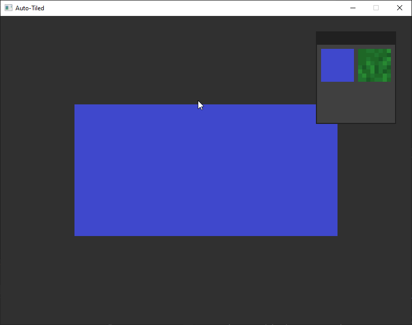

# Auto-Tiled

## Spis treści
- [Opis](#opis)
- [Zrzuty ekranu](#zrzuty-ekranu)

## Opis
**Auto-Tiled** to program, dzięku któremu w wygodny sposób narysujesz mapę. Program działa na zasadzie maski bitowej dla poszczególnych kafelków.

## Zrzuty ekranu

